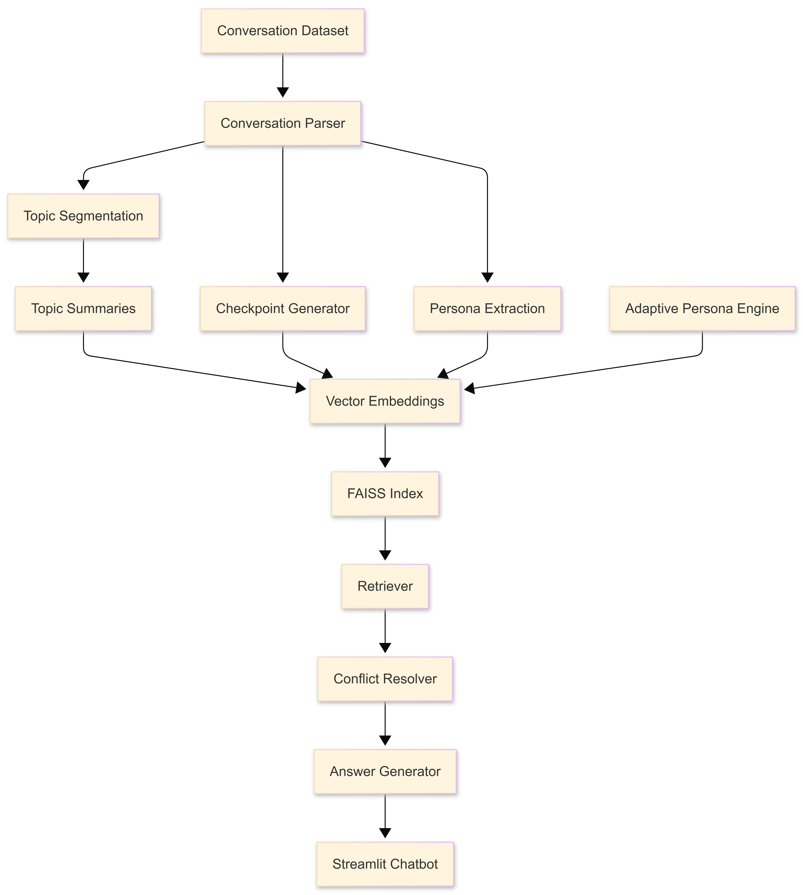
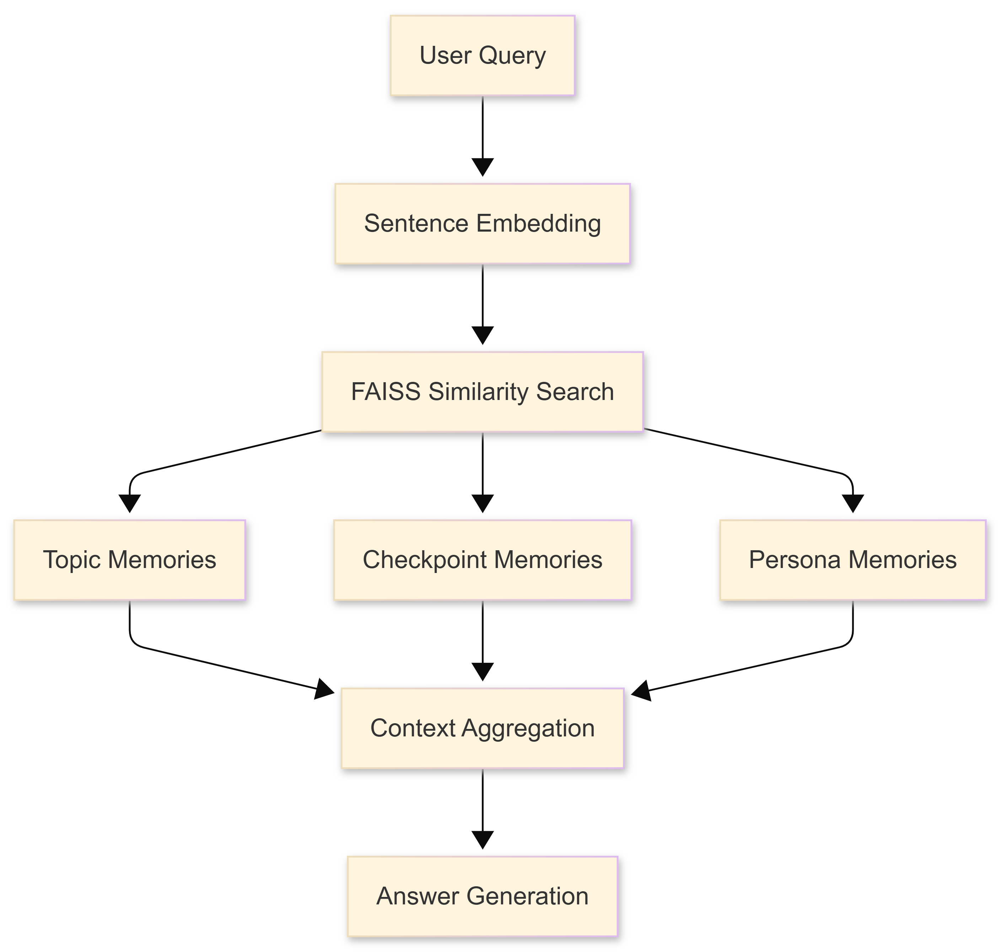

# Persona-Aware Conversational Memory System

> An end-to-end Retrieval-Augmented Generation (RAG) framework that combines semantic topic segmentation, hierarchical conversational memory, adaptive persona modeling, and conflict-aware retrieval for long-term conversational intelligence.

<p align="center">


</p>

---

# 🌐 Live Demo

🔗 **Streamlit Application**

https://kastack-rag-gjqfpaf9dd4aleqqygfryg.streamlit.app/

---

# 📂 GitHub Repository

https://github.com/CHETAN-KAURAV/KaStack-RAG

---

# 📖 Overview

Modern conversational assistants often struggle with maintaining long-term context, remembering user preferences across multiple conversations, and resolving contradictory information accumulated over time.

Traditional Retrieval-Augmented Generation (RAG) systems primarily retrieve semantically relevant documents but generally lack mechanisms for structured conversational memory, evolving user personas, and memory consistency.

This project presents a lightweight conversational memory framework that augments conventional RAG by integrating:

- Semantic Topic Segmentation
- Hierarchical Memory Checkpoints
- Persona Extraction
- Adaptive Persona Evolution
- Conflict-Aware Retrieval
- Offline Intent Classification
- Privacy-Preserving Memory Synchronization

The system processes conversations chronologically, constructs structured conversational memories, indexes them using dense vector embeddings, and retrieves the most relevant contextual information for question answering.

Unlike conventional document-based RAG systems, this framework is designed specifically for long-term conversational intelligence.

---

# 🎯 Motivation

Large Language Models excel at reasoning over retrieved information but often suffer from several limitations in long-term conversations:

- Forgetting earlier interactions
- Losing topic continuity
- Maintaining static user profiles
- Returning conflicting memories
- Limited personalization
- High dependence on proprietary APIs

This project explores how lightweight memory architectures can improve conversational consistency while remaining fully deployable on consumer hardware.

The proposed framework emphasizes:

- Structured conversational memory
- Adaptive user modeling
- Efficient semantic retrieval
- Local deployment
- Explainable memory organization

---

# ✨ Key Features

##  Conversational Memory

- Semantic Topic Segmentation
- Hierarchical Memory Checkpoints
- Long-Term Conversation Compression
- Chronological Memory Organization

---

##  Persona Modeling

- Occupation Extraction
- Hobby Detection
- Personality Trait Identification
- Communication Style Analysis
- Adaptive Persona Evolution

---

##  Retrieval-Augmented Generation

- Dense Semantic Embeddings
- FAISS Vector Database
- Hybrid Memory Retrieval
- Persona-Aware Context Retrieval

---

##  Conversational Intelligence

- Offline Intent Classification
- Conflict Detection
- Contradiction Resolution
- Context Aggregation
- Explainable Retrieval Pipeline

---

##  Deployment

- Fully Offline
- CPU Friendly
- Lightweight Models
- Streamlit Web Interface

---

# 🏗 System Architecture



---

# 🔄 End-to-End Pipeline

```text
Conversation Dataset
        │
        ▼
Conversation Parsing
        │
        ▼
Topic Segmentation
        │
        ▼
Topic Summaries
        │
        ▼
Checkpoint Generation
        │
        ▼
Persona Extraction
        │
        ▼
Embedding Generation
        │
        ▼
FAISS Vector Database
        │
        ▼
Semantic Retrieval
        │
        ▼
Conflict Resolution
        │
        ▼
Context Aggregation
        │
        ▼
Response Generation
        │
        ▼
Streamlit Chatbot
```

---

#  Dataset

The framework operates on multi-turn conversational datasets where each record represents a dialogue between two or more participants.

Each conversation is processed sequentially to preserve temporal dependencies and contextual relationships.

## Dataset Statistics

| Metric | Value |
|----------|---------|
| Conversations | 11,001 |
| Messages | 191,592 |
| Average Messages / Conversation | ~17 |
| Processing Strategy | Chronological |

---

# 🖼 Project Demonstration

## Topic Segmentation


---

## Topic Summaries


---

## Persona Extraction


---

## Chatbot Interface


---

# 🛠 Technology Stack

## Programming

- Python

---

## Data Processing

- Pandas
- NumPy

---

## Natural Language Processing

- Sentence Transformers
- Hugging Face Transformers

---

## Vector Search

- FAISS

---

## Machine Learning

- Scikit-Learn
- Logistic Regression
- TF-IDF Vectorizer

---

## User Interface

- Streamlit

---

## Project Highlights

- End-to-End Conversational RAG

- Semantic Topic Segmentation

- Persona-Aware Retrieval

- Adaptive User Modeling

- Conflict-Aware Memory Retrieval

- Offline Intent Classification

- Privacy-Preserving Memory Design

- Lightweight Local Deployment

---

#  Repository Structure

The repository is organized into modular components for preprocessing, memory construction, retrieval, reasoning, and deployment.

```text
KaStack-RAG/

├── preprocessing/
├── classifier/
├── resolver/
├── drift/
├── outputs/
├── screenshots/
├── design/

├── app.py
├── chatbot.py
├── retriever.py
├── answer_generator.py
├── build_index.py

├── requirements.txt
└── README.md
```

---

#  Core Modules

The project consists of several independent but interconnected modules:

- Conversation Processing
- Topic Segmentation
- Memory Checkpoint Construction
- Persona Extraction
- Adaptive Persona Tracking
- Retrieval-Augmented Generation
- Intent Classification
- Conflict Resolution
- Streamlit Interface

The following sections describe each component in detail.

---

#  System Components

The conversational memory framework is composed of several independent modules that collectively transform raw conversational data into structured long-term memory representations.

Each module is designed to be modular, lightweight, and reusable, allowing future extensions such as agentic memory systems and multi-agent reasoning.

---

# 1️⃣ Conversation Processing

The first stage converts raw conversational records into structured chronological message sequences.

Rather than treating an entire conversation as a single document, the system preserves the temporal order of every message, enabling downstream modules to reason over evolving conversational context.

Each conversation is parsed into:

- Conversation ID
- Speaker
- Message
- Timestamp (if available)
- Chronological order

### Example

```text
Conversation

User A → Hello!

User B → Hi! How are you?

User A → I'm planning to move to Portland.

User B → That's exciting!
```

becomes

```text
Message 1

Speaker : User A

Text : Hello!

↓

Message 2

Speaker : User B

Text : Hi! How are you?

↓

Message 3

Speaker : User A

Text : I'm planning to move to Portland.
```

Preserving message order enables accurate topic detection and memory construction.

---

# 2️⃣ Semantic Topic Segmentation

Long conversations often contain multiple independent topics.

Instead of summarizing an entire conversation into a single memory, the framework detects semantic topic transitions and creates separate topic memories.

This improves retrieval precision by ensuring each memory represents a coherent discussion.

## Methodology

The topic segmentation pipeline consists of the following stages:

1. Create semantic windows from consecutive messages.
2. Generate dense embeddings using Sentence Transformers (`all-MiniLM-L6-v2`).
3. Compute semantic similarity between adjacent windows.
4. Detect topic boundaries when similarity falls below a predefined threshold.
5. Split the conversation into multiple topic segments.
6. Generate an independent summary for each segment.

---

### Workflow

```text
Conversation

↓

Sliding Message Windows

↓

Sentence Embeddings

↓

Cosine Similarity

↓

Topic Boundary Detection

↓

Independent Topic Segments
```

---

### Example

```text
Conversation

Messages 1–12

Planning a trip

↓

Messages 13–25

Hotels in Portland

↓

Messages 26–40

Favorite books
```

Instead of storing one large summary, the system generates three independent memory units.

---

## Benefits

- More accurate retrieval
- Better memory organization
- Reduced irrelevant context
- Improved scalability for long conversations

---

# 3️⃣ Topic Memory Construction

After segmentation, each topic is summarized into a compact memory representation.

Each topic memory stores:

- Topic ID
- Message Range
- Keywords
- Topic Summary

### Example

```text
Topic ID

Topic_07

Messages

13–24

Keywords

Portland
Bookstores
Travel

Summary

Discussion about relocating to Portland and exploring independent bookstores.
```

These summaries become one of the primary retrieval units inside the vector database.

---

# 4️⃣ Hierarchical Memory Checkpoints

Topic memories capture local conversational context.

However, long conversations also require broader contextual understanding.

To address this, the framework generates hierarchical checkpoints every 100 messages.

These checkpoints provide compressed long-term conversational memory.

---

### Workflow

```text
Conversation

↓

100 Messages

↓

Checkpoint Summary

↓

Next 100 Messages

↓

Checkpoint Summary
```

---

### Advantages

- Long-term memory compression
- Faster retrieval
- Reduced token consumption
- Improved scalability

---

### Example

```text
Checkpoint 1

Messages 1–100

↓

Summary

Introductions, travel planning, hobbies

-------------------------

Checkpoint 2

Messages 101–200

↓

Summary

Career discussion, books, relocation
```

---

# 5️⃣ Persona Extraction Engine

Beyond remembering *what* was discussed, conversational agents should also understand *who* they are interacting with.

The Persona Extraction Engine constructs structured user profiles directly from conversation content.

No external APIs or proprietary services are required.

---

## Extracted Information

The system identifies:

- Occupation
- Interests
- Hobbies
- Personality Traits
- Communication Style

These attributes are stored as structured JSON objects.

---

### Example Persona

```json
{
  "occupation": [
    "Teacher"
  ],
  "hobbies": [
    "Reading",
    "Gardening"
  ],
  "traits": [
    {
      "trait": "Curious",
      "score": 8
    }
  ],
  "communication_style": {
    "average_words": 11.3,
    "question_ratio": 0.26,
    "exclamation_ratio": 0.42
  }
}
```

---

## Occupation Detection

The framework searches conversational patterns such as:

```text
I am a teacher

I work as a software engineer

My profession is...
```

Detected occupations are normalized and stored for future retrieval.

---

## Hobby Detection

Interests are extracted using conversational patterns including:

```text
I enjoy...

I love...

I like...

My hobby is...
```

Examples include:

- Reading
- Cooking
- Music
- Hiking
- Photography
- Gardening

---

## Personality Trait Identification

Observable conversational signals are accumulated to infer high-level behavioral traits.

Examples include:

- Curious
- Friendly
- Optimistic
- Enthusiastic
- Analytical

Each trait receives a confidence score based on repeated conversational evidence.

---

## Communication Style Analysis

The framework computes descriptive communication statistics including:

- Average words per message
- Question frequency
- Exclamation frequency
- Conversational engagement

These metrics help characterize user interaction styles beyond semantic content.

---

# 6️⃣ Embedding Generation

After constructing topic memories, checkpoints, and persona records, every memory component is converted into dense vector embeddings.

Embedding generation enables semantic search rather than traditional keyword matching.

The framework uses:

**Sentence Transformers**

```
all-MiniLM-L6-v2
```

to generate compact semantic representations.

---

## Embedded Knowledge Sources

The vector database contains embeddings for:

- Topic Summaries
- Memory Checkpoints
- Persona Profiles

Each memory source contributes complementary contextual information during retrieval.

---

### Embedding Pipeline

```text
Topic Summary

↓

Sentence Transformer

↓

Dense Vector

↓

FAISS Index
```

The same process is applied to checkpoints and persona records.

---

# 7️⃣ Vector Database Construction

All generated embeddings are indexed using Facebook AI Similarity Search (FAISS).

FAISS enables efficient approximate nearest-neighbor search over high-dimensional embedding vectors.

This significantly reduces retrieval latency while maintaining strong semantic matching performance.

---

## Indexed Memory Sources

The FAISS index stores:

- Topic Memories
- Checkpoint Memories
- Persona Memories

These heterogeneous memory representations allow the retrieval system to answer both factual and user-centric questions.

---

## Advantages of FAISS

- Fast similarity search
- Low memory footprint
- CPU-friendly deployment
- Scalable to large conversational datasets

---

# Summary of Processing Pipeline

```text
Conversation Dataset

↓

Conversation Parsing

↓

Topic Segmentation

↓

Topic Summaries

↓

Checkpoint Generation

↓

Persona Extraction

↓

Embedding Generation

↓

FAISS Vector Database
```

At this stage, the framework has transformed raw conversations into structured semantic memories that are ready for retrieval and reasoning.

The following section describes how these memories are retrieved, combined, and used to generate conversational responses.


---

#  Retrieval-Augmented Generation Pipeline

After constructing structured conversational memories, the system performs semantic retrieval to answer user queries using relevant contextual information rather than relying solely on the language model's internal knowledge.

Instead of embedding entire conversations, the framework retrieves multiple complementary memory representations:

- Topic Memories
- Long-Term Memory Checkpoints
- Persona Profiles

These heterogeneous memory sources collectively provide a richer understanding of both **what** was discussed and **who** the conversation is about.

---

## Retrieval Workflow



---

## Step 1 — Query Encoding

When a user submits a question, it is converted into a dense semantic embedding using the same embedding model employed during index construction.

Using identical embedding spaces ensures meaningful similarity comparisons between user queries and stored memories.

---

## Step 2 — Semantic Retrieval

The generated query embedding is passed to the FAISS vector index.

Rather than searching for exact keywords, FAISS retrieves semantically related conversational memories.

Depending on the query, retrieval may include:

- Relevant topic summaries
- Long-term checkpoints
- Persona information

---

### Example

**User Query**

```text
What books does the user enjoy?
```

Retrieved Memories

```text
Topic Summary

↓

Reading habits

↓

Bookstore discussion

↓

Persona Profile

↓

Hobby : Reading
```

---

## Step 3 — Context Aggregation

Retrieved memories are merged into a unified context before response generation.

This aggregation strategy combines:

- Short-term conversational context
- Long-term memory
- User profile information

The resulting context provides a significantly richer representation than any single retrieved document.

---

## Step 4 — Response Generation

The aggregated context is provided to the answer generation module.

The chatbot produces responses grounded in retrieved conversational evidence rather than relying solely on parametric knowledge.

This improves:

- Personalization
- Context awareness
- Consistency
- Factual grounding

---

# Streamlit Chatbot

A lightweight Streamlit application provides an interactive interface for querying the conversational memory system.

The interface allows users to ask natural language questions while visualizing responses generated through the RAG pipeline.

---

## Supported Queries

### Persona Understanding

Examples

```text
What kind of person is this user?

What hobbies does the user have?

Describe the user's communication style.

What occupation does the user have?
```

---

### Context Retrieval

Examples

```text
Tell me about Portland.

What restaurants were discussed?

Summarize the travel conversation.

What books were mentioned?
```

---

### Memory-Based Questions

Examples

```text
What happened earlier?

Has the user's opinion changed?

What has this person talked about recently?
```

---

## Chatbot Workflow

```text
User Question

↓

Embedding Generation

↓

Semantic Retrieval

↓

Context Aggregation

↓

Answer Generation

↓

Response Display
```

---

#  Adaptive Persona Engine

Human preferences evolve over time.

Static user profiles cannot capture these behavioral changes.

To address this limitation, the framework introduces an Adaptive Persona Engine that continuously tracks how a user's communication patterns evolve across conversations.

Instead of storing a single persona snapshot, the system maintains a temporal representation of user behavior.

---

## Objectives

The engine models:

- Personality evolution
- Mood variation
- Communication style changes
- Behavioral drift
- Triggering events

---

## Persona Timeline

Each conversation contributes an updated behavioral profile.

Example timeline

```text
Conversation 01

Mood

Enthusiastic

Tone

Casual

Trigger

Travel

↓

Conversation 07

Mood

Analytical

Tone

Formal

Trigger

Career

↓

Conversation 15

Mood

Reflective

Tone

Calm

Trigger

Books
```

The resulting timeline captures long-term behavioral evolution.

---

## Benefits

- Dynamic personalization
- Improved conversational consistency
- Better long-term user understanding
- Richer contextual retrieval

---

#  Persona Drift Detection

After generating persona timelines, the framework identifies meaningful behavioral transitions.

Instead of assuming a user's profile remains constant, adjacent timeline entries are compared to detect changes.

The system monitors variations in:

- Mood
- Tone
- Personality traits
- Communication statistics

Whenever significant differences are detected, a drift event is recorded.

---

### Drift Detection Pipeline

```text
Conversation History

↓

Persona Timeline

↓

Adjacent Comparison

↓

Behavioral Change Detection

↓

Drift Events
```

---

## Example Drift

```text
Conversation 03

Friendly

↓

Conversation 04

Friendly

↓

Conversation 05

Highly Analytical

↓

Behavioral Drift Detected
```

Tracking these transitions allows conversational agents to adapt retrieval strategies as users evolve.

---

#  Offline Intent Classification

The project includes a lightweight intent classification module for identifying user objectives before retrieval.

Unlike many production systems, this classifier operates entirely offline.

No external APIs or cloud inference services are required.

---

## Supported Intents

- Reminder
- Action Item
- Emotional Support
- Small Talk
- Unknown

---

### Example Predictions

```text
Input

Book a flight tomorrow.

↓

Intent

Action Item
```

---

```text
Input

I feel stressed today.

↓

Intent

Emotional Support
```

---

## Model Architecture

The classifier uses a traditional machine learning pipeline consisting of:

- TF-IDF Vectorization
- Logistic Regression

This lightweight architecture enables fast inference while remaining suitable for CPU deployment.

---

### Classification Pipeline

```text
User Message

↓

TF-IDF Features

↓

Logistic Regression

↓

Predicted Intent
```

---

## Why Traditional Machine Learning?

Compared to large transformer models, this approach provides:

- Faster inference
- Low memory usage
- Minimal computational requirements
- Offline deployment
- High interpretability

This makes it practical for edge devices and resource-constrained environments.

---

# Conflict-Aware Retrieval

One of the challenges in long-term conversational memory is handling contradictory information.

For example, a user may update personal facts over time.

A conventional RAG system often retrieves both statements without determining which one is more reliable.

The proposed framework introduces a conflict-aware retrieval strategy that identifies contradictions before response generation.

---

## Example

Conversation A

```text
My sister lives in Texas.
```

Conversation B

```text
My sister recently moved to California.
```

A naïve retrieval system may return both statements simultaneously.

Instead, the framework performs contradiction analysis before generating the final answer.

---

## Conflict Resolution Pipeline

```text
Retrieved Memories

↓

Claim Extraction

↓

Contradiction Detection

↓

Evidence Ranking

↓

Final Response
```

---

## Claim Extraction

Each retrieved memory is converted into structured factual claims.

Example

```json
{
    "entity":"Sister",
    "attribute":"Location",
    "value":"California"
}
```

Claims are grouped by entity and attribute for contradiction analysis.

---

## Contradiction Detection

If multiple claims provide different values for the same attribute, a potential conflict is identified.

Example

```text
Sister

↓

Texas

↓

California

↓

Potential Conflict
```

---

## Evidence Ranking

Conflicting memories are ranked using multiple contextual signals including:

- Recency
- Conversational relevance
- Emotional importance

Higher-ranked memories receive greater priority during response generation.

---

## Advantages

- More reliable responses
- Improved factual consistency
- Reduced contradictory outputs
- Better long-term memory management

---

#  Privacy-Preserving Synchronization

The project also explores an architecture for synchronizing conversational memories across multiple devices while preserving user privacy.

Instead of uploading raw conversations, only lightweight metadata is synchronized.

---

## Local Storage

Stored locally:

- Raw Conversations
- Dense Embeddings
- Persona Timeline
- Memory Cache

---

## Cloud Synchronization

Only compact metadata is shared:

- Topic Summaries
- Checkpoint Metadata
- Persona Metadata

This minimizes cloud storage while protecting sensitive conversational data.

---

## Synchronization Goals

- Privacy Preservation
- Reduced Storage Cost
- Efficient Synchronization
- Consistent Memory Across Devices
- Offline Accessibility

---

#  Key Contributions

This project extends conventional Retrieval-Augmented Generation by introducing several memory-centric capabilities.

### Contributions

- Semantic Topic Segmentation for conversational memory organization
- Hierarchical checkpoint-based long-term memory
- Structured persona extraction from conversational data
- Adaptive persona evolution across conversations
- Lightweight offline intent classification
- Conflict-aware retrieval for contradictory memories
- Privacy-preserving synchronization architecture
- Modular end-to-end conversational memory framework

Together, these components form a scalable foundation for building personalized, context-aware conversational AI systems capable of maintaining long-term memory while remaining lightweight and deployable on commodity hardware.


---

#  Experimental Results

The proposed conversational memory framework was evaluated on a multi-turn conversational dataset containing over **11,000 conversations** and **191,000+ messages**.

The evaluation focused on validating the complete conversational memory pipeline, including semantic topic segmentation, hierarchical memory construction, persona extraction, retrieval quality, adaptive persona modeling, and conflict-aware reasoning.

Rather than optimizing a single benchmark metric, the primary objective was to demonstrate a scalable and modular architecture capable of supporting long-term conversational intelligence.

---

#  System Capabilities

The completed framework successfully supports the following functionalities:

| Component | Status |
|-----------|--------|
| Conversation Parsing | ✅ |
| Topic Segmentation | ✅ |
| Topic Summarization | ✅ |
| Hierarchical Memory Checkpoints | ✅ |
| Persona Extraction | ✅ |
| FAISS Vector Retrieval | ✅ |
| Adaptive Persona Modeling | ✅ |
| Persona Drift Detection | ✅ |
| Offline Intent Classification | ✅ |
| Conflict-Aware Retrieval | ✅ |
| Privacy-Preserving Synchronization Design | ✅ |
| Interactive Streamlit Chatbot | ✅ |

---

#  Performance Characteristics

The framework is designed for lightweight deployment while maintaining strong semantic retrieval capabilities.

## Key Design Goals

- Lightweight CPU inference
- Fully offline execution
- Modular architecture
- Scalable retrieval
- Low memory footprint
- Fast semantic search

---

## Retrieval Characteristics

The conversational memory system enables:

- Semantic retrieval instead of keyword matching
- Hierarchical memory search
- Context-aware response generation
- Persona-aware retrieval
- Long-term conversational reasoning

---

#  Design Principles

Several engineering principles guided the design of the framework.

---

## Modular Architecture

Every major component is implemented independently.

```text
Conversation Processing

↓

Topic Detection

↓

Persona Extraction

↓

Embedding Generation

↓

Retriever

↓

Chatbot
```

Each module can be modified or replaced without affecting the remaining pipeline.

---

## Explainability

Instead of acting as a black-box retrieval system, every retrieved response can be traced back to one or more conversational memories.

This makes it easier to:

- Debug retrieval errors
- Interpret generated responses
- Analyze memory quality
- Improve future retrieval strategies

---

## Scalability

The framework stores compressed conversational memories rather than complete conversations.

Benefits include:

- Faster indexing
- Reduced storage requirements
- Lower retrieval latency
- Better scalability for large datasets

---

## Extensibility

The modular design enables future integration with:

- Large Language Models
- Agentic AI systems
- Knowledge Graphs
- Multi-Agent Frameworks
- Long-Term Episodic Memory
- Tool-Using Agents

without requiring major architectural changes.

---

# 🔬 Engineering Highlights

The project demonstrates several practical engineering concepts commonly used in modern conversational AI systems.

## Semantic Memory Organization

Instead of indexing entire conversations, information is organized into meaningful semantic units.

Advantages:

- Improved retrieval precision
- Better contextual understanding
- Lower token consumption
- Easier memory management

---

## Hierarchical Memory

The framework combines multiple memory granularities.

```text
Conversation

↓

Topic Memories

↓

Checkpoint Memories

↓

Persona Memories

↓

Retriever
```

This hierarchical organization improves retrieval across both short-term and long-term conversations.

---

## Structured Persona Representation

Instead of relying on raw conversational text, user information is stored as structured metadata.

Example:

```json
{
    "occupation":"Teacher",
    "hobbies":[
        "Reading",
        "Photography"
    ],
    "traits":[
        "Curious",
        "Friendly"
    ]
}
```

Structured personas simplify retrieval and enable efficient personalization.

---

## Adaptive Memory

Unlike static conversational profiles, the system models user evolution across multiple conversations.

This enables:

- Dynamic personalization
- Behavioral analysis
- Drift detection
- Improved conversational consistency

---

## Conflict Resolution

Long-term conversational systems inevitably accumulate contradictory memories.

The framework addresses this challenge through:

- Claim extraction
- Contradiction detection
- Evidence ranking
- Context-aware response generation

This helps produce more reliable responses than naïve retrieval systems.

---

#  Local Deployment

The complete pipeline executes locally without requiring proprietary APIs.

The project primarily relies on open-source libraries including:

- Sentence Transformers
- FAISS
- Hugging Face Transformers
- Scikit-Learn
- Streamlit

This makes the framework suitable for:

- Research
- Education
- Edge deployment
- Privacy-sensitive applications

---

#  Potential Applications

Although originally developed as a conversational memory framework, the underlying architecture can be extended to a variety of AI applications.

Examples include:

###  Personal AI Assistants

Persistent user memory across conversations.

---

###  Educational Tutors

Remembering student preferences, strengths, and learning history.

---

###  Customer Support

Maintaining customer context across multiple interactions.

---

###  Healthcare Assistants

Tracking patient history while preserving privacy.

---

###  Enterprise Knowledge Assistants

Retrieving organizational knowledge using conversational context.

---

###  Digital Journaling Systems

Maintaining structured long-term personal memories.

---

#  Future Work

This project establishes a strong foundation for next-generation conversational memory systems.

Several research directions remain open for future exploration.

---

## Agentic AI Integration

Integrate modern agent frameworks such as:

- LangGraph
- LangChain Agents
- CrewAI
- AutoGen

to enable autonomous planning and multi-step reasoning.

---

## Long-Term Episodic Memory

Implement persistent memory architectures capable of retaining important information across months or years of interaction.

---

## Knowledge Graph Construction

Automatically transform conversational memories into dynamic knowledge graphs for improved reasoning and explainability.

---

## Hybrid Retrieval

Combine:

- Dense Retrieval
- Sparse Retrieval
- Metadata Filtering
- Knowledge Graph Search

to improve retrieval robustness.

---

## Reflection-Based Memory

Introduce self-reflection mechanisms allowing the assistant to:

- evaluate previous responses
- refine memories
- consolidate knowledge
- remove redundant information

---

## Tool-Augmented Agents

Extend the framework with external tools including:

- Web Search
- Calendar APIs
- Email Agents
- Databases
- File Systems

to enable autonomous task execution.

---

## MCP (Model Context Protocol)

Adopt the Model Context Protocol (MCP) for standardized communication between conversational agents, external tools, and long-term memory systems.

---

## Fine-Tuned Embedding Models

Investigate domain-specific embedding models to improve semantic retrieval for specialized conversational datasets.

---

## Reinforcement Learning for Memory Selection

Explore reinforcement learning techniques for dynamically selecting the most relevant conversational memories during retrieval.

---

#  References

This project builds upon concepts from the following areas:

- Retrieval-Augmented Generation (RAG)
- Dense Vector Retrieval
- Semantic Search
- Conversational AI
- User Modeling
- Persona Learning
- Information Retrieval
- Memory-Augmented Neural Systems
- Long-Term Conversational Memory

---

#  Contributing

Contributions, suggestions, and discussions are always welcome.

If you have ideas for improving the retrieval pipeline, memory architecture, or conversational reasoning capabilities, feel free to open an issue or submit a pull request.

---

# ⭐ If you found this project useful

If this repository helped you learn something or inspired your own work, consider giving it a ⭐ on GitHub.

It helps increase the visibility of the project and motivates future development.

---

#  Author

**Chetan Kaurav**

Computer Science & Engineering

Research Interests:

- Conversational AI
- Retrieval-Augmented Generation
- Agentic AI
- Large Language Models
- Computer Vision
- Deep Learning
- Machine Learning

---

#  Contact

 Email:

**chetankaurav9@gmail.com**
**0905cs231068@itmgwalior.in**

---

#  License

This project is released under the **MIT License**.

You are free to use, modify, and distribute the project while retaining appropriate attribution.

---

> **"Building conversational AI is not just about generating responses—it's about enabling systems to remember, reason, and adapt over time."**